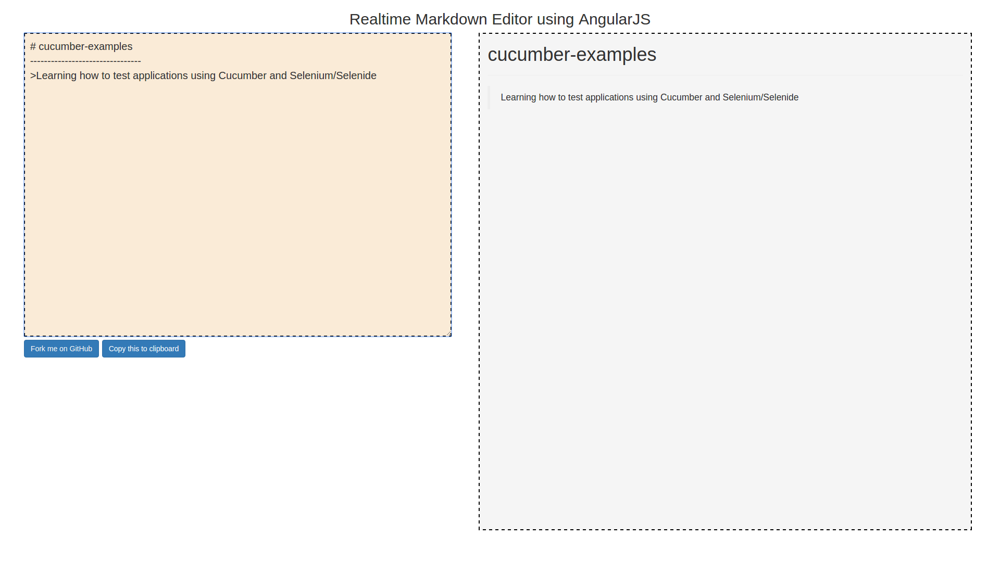

# markdown-editor

> Realtiome Markdown Editor using `AngularJS` 

It is working decent right now using GitHub Markdown API. Though I'm using no-auth version which only allows 60 requests/hr. That is a major drawback right now. I wish to extend it using Auth in future.

